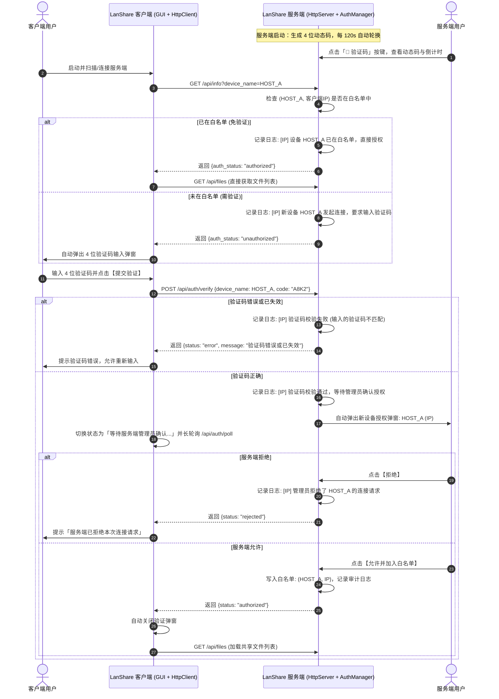

# LanShare V4.2 权限验证与设备白名单授权系统设计规格书

> **文档版本**：`V4.2-Auth-Spec`  
> **创建日期**：`2026-08-18`  
> **核心模块**：动态验证码引擎、服务端人工授权确认、`(设备名, IP)` 复合白名单机制、HTTP 接口权限拦截与实时审计日志

---

## 一、需求背景与目标

在局域网大文件传输场景中，为防止未经授权的局域网设备直接扫描或获取服务端共享目录中的敏感文件，系统需在现有 V4 架构基础上新增双向权限认证防护：

1. **服务端 4 位动态验证码**：
   - 采用英文字母（不区分大小写）和数字混合组成。
   - 每 2 分钟自动随机轮换一次，亦支持服务端用户随时手动刷新。
   - 提供美观的「🔐 验证码」按键与弹窗查看界面。
2. **客户端连接验证拦截**：
   - 客户端连接未授权服务端时，自动弹出验证码输入弹窗。
   - 在完成全流程权限验证前，服务端严格封锁文件列表与传输通道（返回 HTTP 403），客户端界面展示锁定占位。
3. **服务端权限验证总开关（免密开关）**：
   - 在服务端验证码窗口提供「启用客户端连接权限验证」开关（默认开启）。
   - 用户可随时关闭权限验证；关闭后所有局域网设备可免密直连，无需输入验证码。
4. **服务端设备人工授权确认**：
   - 客户端输入正确验证码后，服务端自动弹出确认弹窗，展示客户端「设备名称（Hostname）」与「IP 地址」。
   - 服务端用户确认后允许接入，并将 `(设备名称, IP 地址)` 复合键写入持久化白名单。
   - 后续同一设备（设备名与 IP 均未改变）再次连接时直接免密接入。
5. **服务端详尽审计日志**：
   - 服务端控制台与界面日志区必须实时记录所有验证码轮换、校验尝试、授权申请、开关切换、白名单命中与非法拦截事件。

---

## 二、时序与协议设计

---

## 三、各层架构设计

### 1. 认证核心引擎 (`core/auth.py`)
- `AuthCodeManager`：
  - 维护当前 4 位验证码（去混淆字符 `[2-9A-HJ-NP-Z]`，统一转大写比对）。
  - 120 秒高精度定时轮换，对外暴露 `remaining_seconds` 与 `code`。
- `ServerAuthManager`：
  - 管理待审批队列 `PendingRequests`（含自动超时机制）。
  - 管理**会话级白名单**（生命周期与服务端 App 运行保持一致：不关界面重启服务时保留白名单，重新打开 App 时自动清空，严格以 `(device_name, ip)` 复合二元组判定）。
  - 提供 `is_client_authorized(device_name, ip)`、`submit_verification(...)`、`approve_request(...)`、`reject_request(...)`。

### 2. HTTP 服务端权限拦截 (`core/http_server.py`)
- 拦截点：
  - `/api/files`（文件列表查询）
  - `/api/info`（基础信息与认证状态）
  - `GET /<filename>`（静态文件下载）
  - `PUT/POST /<filename>`（文件上传）
- 未通过认证的客户端直接返回 `403 Forbidden`。

### 3. 服务端审计日志规范
服务端记录的日志格式包括：
- `[IP] 验证码已自动/手动更新: [XXXX] (有效时间 120 秒)`
- `[IP] 设备 [DeviceName] 已在白名单中，自动允许连接`
- `[IP] 设备 [DeviceName] 正在进行身份验证...`
- `[IP] 设备 [DeviceName] 验证码错误: 输入 [YYYY] != 当前 [XXXX]`
- `[IP] 设备 [DeviceName] 验证码正确，等待管理员授权确认`
- `[IP] 管理员已允许设备 [DeviceName] 连接，并加入白名单`
- `[IP] 管理员拒绝了设备 [DeviceName] 的连接请求`
- `[IP] 未授权请求被拦截 (403): 尝试访问 /api/files`

---

## 四、测试与验收指标

1. **4位验证码**：大小写不敏感匹配，2分钟自动失效与手动更新。
2. **白名单判定**：设备名或 IP 任意一项变更时重新触发验证流程。
3. **接口防御**：未授权客户端完全无法获取文件列表或进行上传/下载。
4. **UI交互**：双端弹窗顺畅、视觉精致，日志信息实时可查。
