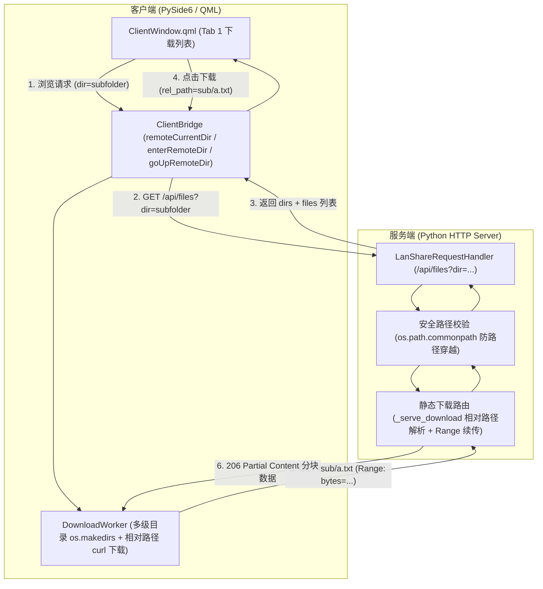

# LanShare V4.3 客户端支持服务端共享子目录浏览与下载设计规格书

> **设计日期**：2026-08-18  
> **版本标识**：V4.3  
> **设计主题**：客户端远端子目录递归浏览、层级导航与多级断点续传下载

---

## 1. 需求背景与目标

在当前 LanShare 系统中：
- 「📤 向服务端推送」列表（Tab 2）具备完整的本地目录浏览体验（支持文件夹识别 📁、双击/点击进入子文件夹、点击「⬆ 返回上级」以及文件推送）。
- 「📥 从服务端下载」列表（Tab 1）仅展示服务端根目录下的扁平单层文件，过滤掉了所有子文件夹，且下载路由仅支持 `os.path.basename` 文件名。

**本次升级目标**：
全面升级服务端与客户端的数据接口、传输引擎和界面交互，让客户端的**下载文档列表与上传列表保持完全一致的交互体验**：
1. 能够识别并区分 📁 文件夹与 📄 普通文件；
2. 能够双击或点击「📂 打开」进入/浏览子文件夹；
3. 能够在进入子目录后显示当前远端路径并提供「⬆ 返回上级」按钮；
4. 能够准确下载多级子目录中的文件，且在客户端本地下载保存目录下**自动递归创建对应层级的子文件夹**（保持目录树结构）；
5. 完整兼容底层的 HTTP Range 分块断点续传与 10 次自动重试机制。

---

## 2. 系统架构与通信交互流程



---

## 3. 核心技术改造方案

### 3.1 服务端通信与路由改造 (`core/http_server.py`)

1. **`/api/files` 文件列表接口增强**：
   - 接收 `dir` 查询参数（URL 编码的相对路径），默认为空字符串（即根目录）。
   - **严格安全校验**：通过 `os.path.commonpath` / `os.path.abspath` 校验目标目录是否严格位于 `share_dir` 内，防御 `../` 目录穿越攻击。
   - 分别收集直属子文件夹（`is_dir: True`）与直属子文件（`is_dir: False`）：
     - 文件夹项：`{"name": "docs", "rel_path": "docs", "is_dir": True, "size": 0, "mtime": ...}`
     - 文件项：`{"name": "report.pdf", "rel_path": "docs/report.pdf", "is_dir": False, "size": 10240, "mtime": ...}`
   - 响应格式保持向后兼容：
     ```json
     {
       "current_dir": "docs",
       "can_go_up": true,
       "files": [ ... ]
     }
     ```
2. **`_serve_download` 静态文件下载路由升级**：
   - 移除 `os.path.basename` 强制截断，保留完整相对路径（如 `/docs/2026/report.pdf`）。
   - 解析 URL 相对路径并规范化（`os.path.normpath`），执行安全边界校验。
   - 保持原有的 `Range: bytes=start-end`、`206 Partial Content`、`WSAENOBUFS` 重试与断点续传逻辑不变。

### 3.2 客户端网络请求与工作器改造 (`core/http_client.py`)

1. **`HttpClient.get_remote_files(server_url, timeout=4.0, device_name="", dir_path="")`**：
   - 支持传入 `dir_path` 相对路径参数，拼接 `&dir={encoded_dir}` 发起请求。
2. **`HttpClient.get_remote_file_size(server_url, rel_path, ...)`**：
   - 支持多级相对路径的 HEAD 请求获取远端大小。
3. **`DownloadWorker` 路径适配与本地目录递归创建**：
   - 接收 `rel_path`（相对路径）与 `filename`（显示用文件名）。
   - 确定本地目标路径 `dest_path = os.path.join(self.local_dir, self.rel_path.replace("/", os.sep))`。
   - 下载启动前通过 `os.makedirs(os.path.dirname(dest_path), exist_ok=True)` 自动在本地创建对应的多级父文件夹。
   - `curl.exe` 请求目标 URL 拼接为 `{server_url}/{encoded_rel_path}`，保证断点续传能够正确对应远端文件。

### 3.3 客户端桥接与状态机改造 (`gui/bridge_client.py`)

1. **远端目录导航状态管理**：
   - 增加属性 `remoteCurrentDir`（当前所在远端相对路径，如 `""`、`"docs"`、`"docs/sub"`）。
   - 增加属性 `canGoUpRemoteDir`（是否可返回上级，`bool(self._remote_current_dir)`）。
2. **目录跳转与刷新方法**：
   - `@Slot(str) def enterRemoteDir(self, dir_name: str)`：更新 `_remote_current_dir` 为子路径并调用 `refreshRemoteFiles()`。
   - `@Slot() def goUpRemoteDir(self)`：返回上一级远端相对目录并刷新。
   - `@Slot() def refreshRemoteFiles(self)`：向服务端请求当前 `_remote_current_dir` 下的目录与文件列表。
3. **下载任务创建升级**：
   - `@Slot(str, str) def startDownload(self, filename: str, rel_path: str = "")`：任务对象携带 `rel_path`，传给 `DownloadWorker` 执行。

### 3.4 客户端 QML 界面交互对齐 (`gui/qml/ClientWindow.qml`)

在 Tab 1（📥 从服务端下载）中重构界面组件，完全对齐 Tab 2 的使用习惯：
1. **顶部导航栏**：
   - 保留本地保存目录选择器。
   - 新增**远端当前目录指示器**（展示 `远端目录: /` 或 `远端目录: /docs/2026/`）与「⬆ 返回上级」按钮（`btnUpRemoteDir`，在进入子目录后高亮可用）。
2. **文件/文件夹列表视图**：
   - 区分文件夹行与普通文件行：
     - **文件夹条目**：显示 📁 图标、文件夹名称、大小栏显示为“文件夹”、操作栏显示「📂 打开」按钮（双击或点击按钮均可进入子文件夹）。
     - **文件条目**：显示 📄 图标、文件大小、修改时间、操作栏显示「📥 下载」按钮（双击或点击按钮启动下载/排队）。
3. **视觉与交互细节**：
   - 保持 Fluent 规范、斑马纹高亮与平滑滚动条。

---

## 4. 验证与测试规范

1. **单元与集成测试 (`tests/test_core.py`)**：
   - 自动化测试多层子目录创建、`/api/files?dir=...` 接口返回、非法路径穿越请求防护校验（403/404）。
   - 自动化测试多级子目录大文件的 Range 断点续传与本地自动创建子目录的完整性。
2. **UI 与端到端回归测试**：
   - 确保双击文件夹进入、点击返回上级、排队下载多级目录文件均正常工作。
